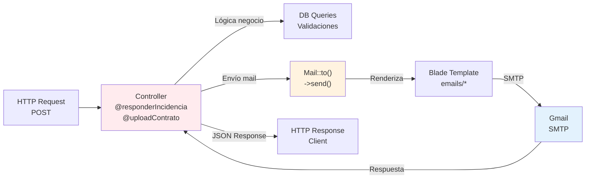
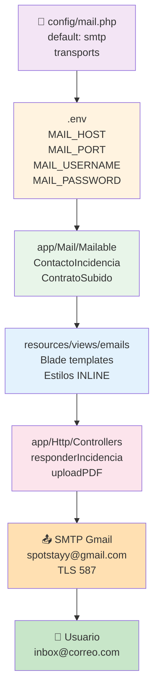

# 📊 Diagrama de Flujo - Sistema de Mails SpotStay

## FLUJO COMPLETO DE ENVÍO DE MAILS

```mermaid
graph TD
    A1["👤 ADMIN<br/>Panel de Incidencias<br/>/admin/incidencias"] -->|Escribe respuesta| A2["📝 Selecciona<br/>- Asunto<br/>- Mensaje<br/>- Destinatario"]
    
    A2 -->|POST responderIncidencia| A3["🔍 IncidenciaController<br/>responderIncidencia()"]
    
    A3 -->|Busca email| A4{Tipo de<br/>Destinatario?}
    
    A4 -->|inquilino| A5["📧 DB Query<br/>tbl_usuario<br/>id_reporta_fk"]
    A4 -->|gestor| A6["📧 DB Query<br/>tbl_usuario<br/>id_asignado_fk"]
    A4 -->|arrendador| A7["📧 DB Query<br/>tbl_usuario<br/>via tbl_propiedad"]
    
    A5 --> A8["✉️ new ContactoIncidencia<br/>- incidencia<br/>- asunto<br/>- mensaje<br/>- nombre"]
    A6 --> A8
    A7 --> A8
    
    A8 -->|Mail::to()| A9["📤 SMTP Client<br/>Gmail SMTP<br/>smtp.gmail.com:587"]
    
    A9 -->|Renderiza| A10["🎨 View Builder<br/>emails.contacto_incidencia<br/>- Estilos INLINE<br/>- Variables dinámicas"]
    
    A10 -->|TLS Encrypt| A11["🔐 Encriptación TLS<br/>📨 Envía a Gmail"]
    
    A11 -->|Entrega| A12["✅ Email en<br/>Bandeja del Usuario<br/>contacto@usuario.com"]
    
    style A1 fill:#e8f5e9
    style A3 fill:#fff3e0
    style A8 fill:#f3e5f5
    style A9 fill:#e3f2fd
    style A12 fill:#c8e6c9
```

---

## FLUJO DE CONTRATO SUBIDO

```mermaid
graph TD
    B1["👤 ARRENDADOR<br/>Panel de Contratos<br/>/contratos"] -->|Sube archivo| B2["📁 Selecciona PDF<br/>form upload<br/>id_contrato"]
    
    B2 -->|POST upload| B3["🔧 ContratoController<br/>línea ~234"]
    
    B3 -->|1. Guarda archivo| B4["💾 Almacenamiento<br/>public/contratos/<br/>archivo.pdf"]
    
    B3 -->|2. Construye URL| B5["🔗 URL Completa<br/>getSchemeAndHttpHost()<br/>+ rutaRelativa"]
    
    B3 -->|3. Busca inquilino| B6["🔍 DB Query<br/>JOIN tbl_contrato<br/>JOIN tbl_alquiler<br/>JOIN tbl_usuario"]
    
    B6 -->|email_usuario| B7["✉️ new ContratoSubido<br/>- idAlquiler<br/>- nombreInquilino<br/>- urlPdf"]
    
    B7 -->|Mail::to()| B8["📤 SMTP Client<br/>Gmail SMTP<br/>smtp.gmail.com:587"]
    
    B8 -->|Renderiza| B9["🎨 View Builder<br/>emails.contrato_subido<br/>- Verde SpotStay<br/>- Link descarga"]
    
    B9 -->|TLS Encrypt| B10["🔐 Encriptación TLS<br/>📨 Envía a Gmail"]
    
    B10 -->|Entrega| B11["✅ Email en<br/>Bandeja Inquilino<br/>inquilino@correo.com"]
    
    B11 -->|Usuario clicks| B12["📥 Descarga PDF<br/>route contratos.descargar"]
    
    style B1 fill:#e8f5e9
    style B3 fill:#fff3e0
    style B7 fill:#f3e5f5
    style B8 fill:#e3f2fd
    style B12 fill:#c8e6c9
```

---

## ARQUITECTURA ACTUAL (Acoplada)



---

## FLUJO CON QUEUE (Recomendado futuro)

```mermaid
graph TD
    D1["Controller<br/>responderIncidencia"]
    D1 -->|Mail::to()| D2["Queue Driver<br/>database/redis"]
    D2 -->|Guarda job| D3["Queue Table<br/>jobs"]
    D3 -->|Respuesta rápida| D4["✅ HTTP 200<br/>Usuario"]
    D4 -->|En background| D5["⚙️ Queue Worker<br/>php artisan queue:work"]
    D5 -->|Dequeue| D6["SendMailJob<br/>ejecuta"]
    D6 -->|SMTP| D7["Gmail<br/>SMTP"]
    D7 -->|Success| D8["✅ Mail enviado"]
    D7 -->|Fail| D9["Reintentos<br/>x3 attempts"]
    
    style D1 fill:#fff3e0
    style D4 fill:#c8e6c9
    style D7 fill:#e3f2fd
    style D8 fill:#a5d6a7
```

---

## CONFIGURACIÓN EN CAPAS



---

## MATRIZ DE DISPARADORES

| Disparador | Controller | Método | Mailable | Destinatario |
|------------|-----------|--------|----------|--------------|
| Respuesta Incidencia | Admin\IncidenciaController | responderIncidencia() | ContactoIncidencia | Inquilino/Gestor/Arrendador |
| Subida Contrato | Arrendador\ContratoController | ~línea 234 | ContratoSubido | Inquilino |

---

## SECUENCIA TEMPORAL

### Incidencia (Síncrono)
```
t=0ms    Usuario hace click en "Responder"
t=10ms   HTTP POST llega al servidor
t=20ms   Controlador consulta BD para email
t=30ms   Crea instancia ContactoIncidencia
t=40ms   Conecta a Gmail SMTP
t=50ms   Renderiza template Blade
t=100ms  Envía SMTP AUTH + Message
t=200ms  Gmail acepta mensaje
t=210ms  Desconecta SMTP
t=220ms  Controlador retorna JSON success
t=230ms  Cliente recibe respuesta ✓ BLOQUEANTE
```

### Contrato (Síncrono)
```
t=0ms    Usuario sube PDF
t=10ms   HTTP POST multipart
t=50ms   Servidor guarda archivo en /public/contratos/
t=60ms   Consulta BD para email del inquilino
t=70ms   Crea instancia ContratoSubido
t=100ms  Conecta a Gmail SMTP
t=150ms  Renderiza template Blade
t=200ms  Envía mensaje SMTP
t=300ms  Gmail acepta
t=310ms  Desconecta SMTP
t=320ms  Retorna JSON success
t=330ms  Cliente recibe respuesta ✓ BLOQUEANTE
```

---

## VARIABLES INTERPOLADAS EN MAILS

### ContactoIncidencia
```blade
{{ $destinatarioNombre }}       // Juan García
{{ $incidencia->id_incidencia }} // 5
{{ $incidencia->prioridad_incidencia }} // alta
{{ $mensaje }}                  // "Se ha revisado su incidencia..."
{{ $urlLogin }}                 // https://spotcenter.local/login
```

### ContratoSubido
```blade
{{ $nombreInquilino }}          // Carlos Ruiz
{{ $idAlquiler }}               // 12
{{ $urlPdf }}                   // https://spotcenter.local/contratos/download/5
```

---

## MÉTODOS SMTP UTILIZADOS

```
1. SMTP AUTH
   USER spotstayy@gmail.com
   PASS [app-password]

2. SEND MESSAGE
   FROM: spotstayy@gmail.com (SpotStay)
   TO: usuario@correo.com
   SUBJECT: [Dinámico]
   BODY: [HTML Renderizado]

3. CLOSE
   QUIT
```

---

## FORMATOS DE RESPUESTA

### ✅ Éxito - Incidencia
```json
{
  "success": true
}
```

### ❌ Error - Incidencia
```json
{
  "success": false,
  "error": "Exception message"
}
```

### ✅ Éxito - Contrato
```json
{
  "success": true,
  "message": "PDF subido correctamente.",
  "url_pdf": "https://spotcenter.local/contratos/contrato_5.pdf"
}
```

### ❌ Error - Contrato (Silencioso)
```
Log error en storage/logs/laravel.log
Mail no se envía pero PDF sí se guarda
HTTP 200 OK (no se ve el error al usuario)
```

