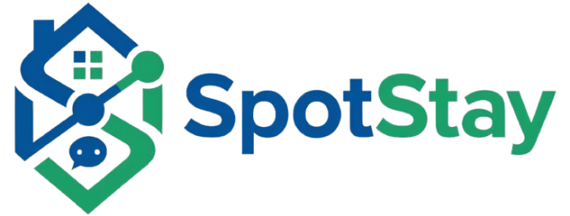

<p align="center">
  
</p>

# SpotStay - Plataforma de Gestión de Alquileres

**SpotStay** es una solución integral diseñada para simplificar y profesionalizar la gestión de alquileres de viviendas. La plataforma conecta a propietarios, inquilinos y gestores técnicos en un ecosistema digital eficiente, permitiendo desde la búsqueda de inmuebles hasta la gestión compleja de incidencias y contratos.

---

## Roles y Flujos del Sistema

El sistema se basa en cuatro pilares de usuario, cada uno con un panel de control especializado:

### 1. Administrador (Control Total)

* **Gestión de Usuarios**: Alta, baja y edición de perfiles.
* **Supervisión**: Monitorización de todas las propiedades, alquileres y suscripciones.
* **KPIs**: Estadísticas en tiempo real sobre el estado de la plataforma.

### 2. Arrendador (Propietario)

* **Publicación**: Gestión del catálogo de propiedades (fotos, precios, características).
* **Filtro de Candidatos**: Recepción y gestión de solicitudes de alquiler.
* **Contratos**: Firma digital de contratos y seguimiento de cobros.

### 3. Gestor (Mantenimiento Técnico)

* **Incidencias**: Recepción de avisos técnicos reportados por inquilinos.
* **Presupuestos**: Creación y gestión de presupuestos para reparaciones.
* **Intervenciones**: Registro de acciones realizadas en la propiedad.

### 4. Miembro / Inquilino

* **Búsqueda**: Exploración de propiedades mediante listas y mapas interactivos.
* **Solicitud**: Proceso de aplicación para alquilar una vivienda.
* **Vida en la Vivienda**: Una vez alquilada, el miembro pasa a ser **Inquilino**, pudiendo reportar incidencias, chatear con el propietario y pagar sus cuotas mensuales.

---

## Flujo Operativo Principal

1. **Exploración**: Un usuario se registra como **Miembro** y busca una propiedad.
2. **Solicitud**: Envía una solicitud de alquiler al **Arrendador**.
3. **Aprobación y Firma**: El arrendador aprueba la solicitud y se genera un **Contrato**. Ambos firman digitalmente.
4. **Gestión Activa**: El miembro se convierte en **Inquilino**. Recibe avisos de pago mensuales (**Cuotas**).
5. **Mantenimiento**: Si surge un problema, el inquilino reporta una **Incidencia**. El **Gestor** la recibe, genera un presupuesto y, tras la aprobación/pago, realiza la reparación.

---

## Base de Datos

El sistema utiliza una arquitectura relacional sólida. Las entidades principales son:

* **`tbl_usuarios`**: Almacena credenciales, datos fiscales y roles (Polimorfismo para roles).
* **`tbl_propiedades`**: Detalles técnicos, dirección (desglosada por calle, número, ciudad) y estado de disponibilidad.
* **`tbl_alquileres`**: El nexo de unión entre inquilino, propiedad y arrendador.
* **`tbl_incidencias`**: Registro de problemas, estados (abierta, en proceso, cerrada) y asignación a gestores.
* **`tbl_cuotas_alquiler`**: Control financiero de los pagos mensuales.

---

## Acceso Rápido (Demo)

Para probar el sistema rápidamente, utiliza las siguientes credenciales tras ejecutar los seeders. Todas las cuentas comparten la misma contraseña:

**Contraseña**: `password123`

| Rol               | Email                     | Propósito                            |
| :---------------- | :------------------------ | :----------------------------------- |
| **Administrador** | `agarcia@spotstay.com`    | Gestión global y configuración.      |
| **Arrendador**    | `jlavignole@spotstay.com` | Gestionar propiedades y solicitudes. |
| **Gestor**        | `mgestor@spotstay.com`    | Atender incidencias técnicas.        |
| **Inquilino**     | `snebot@spotstay.com`     | Ver su alquiler y reportar fallos.   |
| **Miembro**       | `rdiaz@spotstay.com`      | Navegar y solicitar alquileres.      |

---

## Instalación

Sigue estos pasos para levantar el proyecto localmente:

1. **Clonar el repositorio**:

   ```bash
   git clone https://github.com/ManuelGalvez96/SpotStay.git
   cd SpotStay
   ```
2. **Configurar dependencias**:

   ```bash
   composer install
   npm install
   ```
3. **Configurar entorno**:

   * Crea una copia de `.env.example` y nómbrala `.env`.
   * Configura tu base de datos en las variables `DB_DATABASE`, `DB_USERNAME`, etc.
   * Genera la clave de aplicación: `php artisan key:generate`.
   * Si vas a enviar correos desde la app, configura también las variables SMTP en `.env`:

   ```env
   MAIL_MAILER=smtp
   MAIL_HOST=smtp.gmail.com
   MAIL_PORT=587
   MAIL_USERNAME=spotstayy@gmail.com
   MAIL_PASSWORD=tu_contraseña_de_app
   MAIL_ENCRYPTION=tls
   MAIL_FROM_ADDRESS=spotstayy@gmail.com
   MAIL_FROM_NAME="SpotStay"
   ```

   * `MAIL_FROM_ADDRESS` solo define el remitente visible del correo.
   * El destinatario real se elige en `app/Http/Controllers/Admin/IncidenciaController.php`, dentro del método `contactar()`, según el usuario seleccionado o el rol correspondiente.
   * Si quieres que un correo llegue a varios usuarios a la vez, ese comportamiento se debe añadir en ese método usando `cc()`, `bcc()` o enviando el mensaje a más de un destinatario.
4. **Base de Datos y Datos de Prueba**:

   ```bash
   php artisan migrate --seed
   ```
5. **Ejecución**:

   ```bash
   # En terminales separadas o usando el script dev de composer:
   composer run dev
   ```

---

## Documentación Adicional

Para más detalles sobre módulos específicos, consulta los siguientes manuales:

* [Gestión de Propiedades](README_PROPIEDADES.md)
* [Flujo de Solicitudes](README_SOLICITUDES.md)
* [Administración de Usuarios](README_USUARIOS.md)
* [Panel de Administración](README_ADMIN_DASHBOARD.md)
  <hr>
